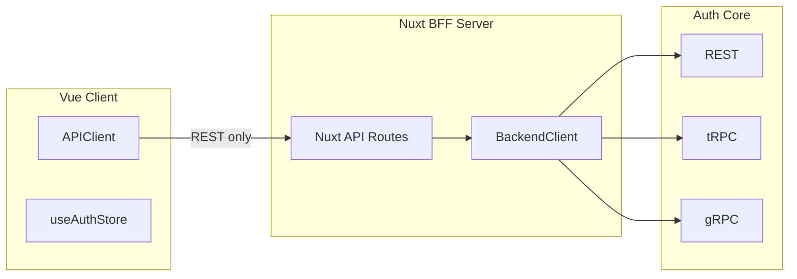

# BFF Changes Plan – Auth Client Vue

Plan for Backend-for-Frontend (BFF) changes: unified API instance, multi-mode backend communication (REST/tRPC/gRPC), request/response header management, and cookie handling.

---

## 1. Architecture Overview



**Flow:**
- **Client → BFF**: Always REST (Nuxt server routes at `/api/*`). Client uses `APIClient` or `commonApi`.
- **BFF → Backend**: Configurable mode (REST | tRPC | gRPC). BFF constructs headers and forwards.

**Deployment:** BFF and frontend are co-hosted on the same port/origin (Nuxt serves both). The client only ever calls the BFF; it never talks to the backend directly. BFF is the sole gateway to auth-core.

---

## 2. Request Headers (BFF → Backend)

| Header | Source | Utility | When Attached |
|--------|--------|---------|----------------|
| **Authorization** | Bearer \<proxy-token\> from client request | Authorizer (PDP) – validates session for sensitive actions | Authenticated requests only |
| **X-Tenant-ID** | `authStore.user.tenantId` (resolved by BFF from token/session) | Ensures tenant isolation in Auth Backend | When user/session has `tenantId` |
| **X-Correlation-ID** | `crypto.randomUUID()` per request | Logs/tracing, brute-force tracking across Gateway | Every outbound request |
| **X-Platform-ID** | Static `celestial-auth-web` | Gateway (WAF) – stricter rate-limiting for auth endpoints | Every outbound request |

---

## 3. Implementation Structure

### 3.1 Shared BFF Utilities

Create `server/utils/`:

| File | Purpose |
|------|---------|
| `server/utils/backendClient.ts` | Unified client for BFF→Backend. Accepts mode (REST/tRPC/gRPC), builds headers, executes request. |
| `server/utils/requestHeaders.ts` | `buildBackendHeaders(event, options?)` – builds Authorization, X-Tenant-ID, X-Correlation-ID, X-Platform-ID. |
| `server/utils/responseCookies.ts` | `forwardSetCookie(event, response)` – forwards `Set-Cookie` from backend to client. |

### 3.2 Header Construction (BFF)

```ts
// server/utils/requestHeaders.ts

export type BackendHeaderOptions = {
  authenticated?: boolean;  // include Authorization
  tenantId?: string;        // X-Tenant-ID
};

export function buildBackendHeaders(
  event: H3Event,
  options: BackendHeaderOptions = {}
): Record<string, string> {
  const headers: Record<string, string> = {
    'Content-Type': 'application/json',
    'X-Correlation-ID': crypto.randomUUID(),
    'X-Platform-ID': 'celestial-auth-web',
  };

  if (options.authenticated) {
    const auth = getHeader(event, 'authorization');
    if (auth) headers['Authorization'] = auth;
  }

  if (options.tenantId) {
    headers['X-Tenant-ID'] = options.tenantId;
  }

  return headers;
}
```

**Tenant resolution**: BFF gets `tenantId` from:
1. Decoded JWT/session (if BFF stores or decodes it), or
2. Forwarded header `X-Tenant-ID` from client (client reads `authStore.user.tenantId` and sends it when calling authenticated APIs).

---

## 4. Backend Client Modes

### 4.1 REST (Current)

- **Status**: Already in use.
- **Change**: Use `buildBackendHeaders()` and `forwardSetCookie()` in all BFF handlers.
- **Location**: `server/api/auth/**/*.ts`.

### 4.2 tRPC

- **Add**: `@trpc/client`, `@trpc/server` (or `@trpc/client` for BFF as client).
- **Structure**:
  - `server/lib/trpc/` – tRPC client config, link to backend.
  - Backend must expose a tRPC router (e.g. `http://auth-core/trpc`).
- **Headers**: Pass `buildBackendHeaders()` into tRPC client `fetch` opts or context.

### 4.3 gRPC

- **Add**: `@grpc/grpc-js` and generated proto stubs.
- **Structure**:
  - `server/lib/grpc/` – gRPC client, channel config.
  - Backend must expose gRPC service.
- **Metadata**: Map `buildBackendHeaders()` to gRPC `metadata` (e.g. `authorization`, `x-tenant-id`, etc.).

---

## 5. Config-Driven API Mode

Add to `nuxt.config.ts` / `app/config/`:

```json
// app/config/bff.json or extend auth.json

{
  "backend": {
    "mode": "rest",
    "baseUrl": "${NUXT_PUBLIC_AUTH_API_URL}",
    "trpcUrl": "${NUXT_PUBLIC_AUTH_API_URL}/trpc",
    "grpcUrl": "${NUXT_PUBLIC_AUTH_GRPC_URL}"
  }
}
```

- `backend.mode`: `"rest"` | `"trpc"` | `"grpc"`.
- BFF handlers use `BackendClient` which switches implementation based on mode.

---

## 6. Client-Side API Instance (Client → BFF)

### 6.1 APIClient – Minimal Headers

**APIClient does NOT add any headers except Authorization.** No X-Tenant-ID, X-Correlation-ID, or X-Platform-ID from the client.

| Header | Source (Client) | When |
|--------|-----------------|------|
| **Authorization** | `authStore.accessToken` | Only when `authenticated: true` |

- For unauthenticated requests (login, signup, refresh, etc.): no custom headers.
- For authenticated requests: only `Authorization: Bearer <token>`.
- X-Correlation-ID, X-Platform-ID, X-Tenant-ID are added by the **BFF** when it calls the backend, not by the client.

### 6.2 auth.json and commonApi

- Remove or simplify `security.requestHeaders` for client-to-BFF requests. The client does not send these headers.
- `commonApi` / `authRequestProvider` should only attach Authorization when `auth: true`; no other custom headers.

---

## 7. Response Headers & Cookies

### 7.1 BFF Response Handling

| Concern | Implementation |
|---------|----------------|
| **Set-Cookie** | Forward from backend response to client via `setHeader(event, 'set-cookie', ...)`. |
| **CORS** | Handled by Nuxt; BFF is same-origin. |
| **X-Request-ID** | Echo `X-Correlation-ID` in response for client debugging (optional). |

### 7.2 Cookie Forwarding

Centralize in `server/utils/responseCookies.ts`:

```ts
export function forwardSetCookie(event: H3Event, response: Response): void {
  const setCookie = response.headers.get('set-cookie');
  if (setCookie) setHeader(event, 'set-cookie', setCookie);
}
```

Use in every BFF handler that calls backend login/refresh/verify endpoints.

---

## 8. File & Endpoint Inventory

### 8.1 New Files

| Path | Purpose |
|------|---------|
| `server/utils/requestHeaders.ts` | `buildBackendHeaders()` |
| `server/utils/responseCookies.ts` | `forwardSetCookie()` |
| `server/utils/backendClient.ts` | Unified REST/tRPC/gRPC client |
| `server/lib/trpc/client.ts` | tRPC client for BFF (when mode=trpc) |
| `server/lib/grpc/client.ts` | gRPC client for BFF (when mode=grpc) |
| `app/config/bff.json` | Backend mode and URLs |

### 8.2 Modified Files

| Path | Changes |
|------|---------|
| `app/utils/APIClient.ts` | No change – already sends only Authorization when `authenticated: true`. Ensure no other headers are added. |
| `app/lib/commonApi.ts` | Ensure only Authorization when `auth: true`; no X-* headers from client. |
| `server/api/auth/**/*.ts` | Use `buildBackendHeaders`, `forwardSetCookie`, and `BackendClient` (BFF adds all non-Auth headers) |

---

## 9. Phased Rollout

| Phase | Scope |
|-------|-------|
| **1** | Add `requestHeaders.ts`, `responseCookies.ts`; update all BFF handlers to use them. BFF adds X-Correlation-ID, X-Platform-ID, X-Tenant-ID when calling backend. Client (APIClient) unchanged – only Authorization when authenticated. |
| **2** | Introduce `BackendClient` with REST implementation only (refactor existing fetch calls). |
| **3** | Add tRPC mode (config + client) when backend supports it. |
| **4** | Add gRPC mode (config + client) when backend supports it. |

---

## 10. Quick Reference – Header Mapping

| Header Key | Layer | Source | Why |
|------------|-------|--------|-----|
| **Authorization** | Client → BFF | `authStore.accessToken` | Only when `authenticated: true`. BFF forwards to backend for sensitive actions. |
| **X-Tenant-ID** | BFF → Backend | BFF resolves from token/session | Tenant isolation |
| **X-Correlation-ID** | BFF → Backend | `crypto.randomUUID()` | Logs/tracing, brute-force tracking |
| **X-Platform-ID** | BFF → Backend | Static `celestial-auth-web` | Gateway rate-limiting |

**Client sends only Authorization (when authenticated). All other headers are added by the BFF when calling the backend.**

---

## 11. Open Points

1. **Tenant resolution on BFF**: Does auth-core return `tenantId` in the token/session, or must the client always send it?
2. **tRPC/gRPC backend support**: Confirm auth-core will expose tRPC and/or gRPC endpoints.
3. **Proto / tRPC router**: Shared definitions (proto files, tRPC router) for codegen and types.
